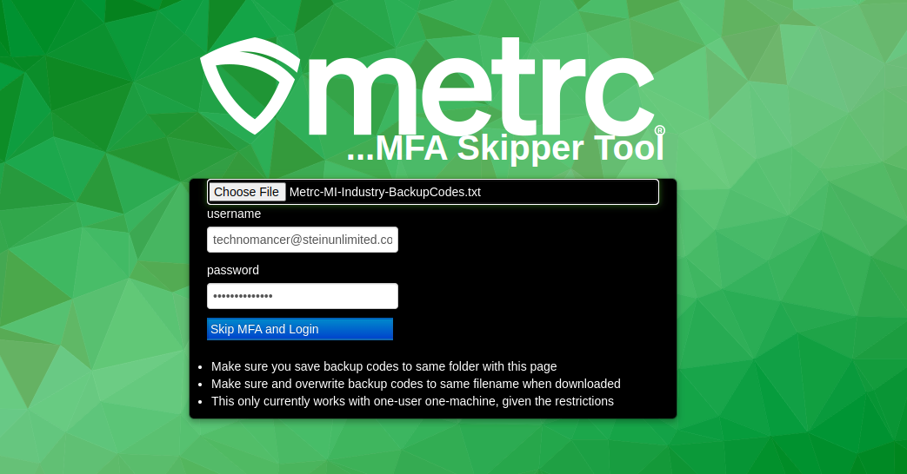

# MFA Metrc Login Skipper

A custom in-house browser tool that automates the **Metrc** login process using backup codes to bypass manual MFA entry.  

Designed for Michigan (or any Metrc state) operators frustrated by repetitive MFA logins when Metrc began requiring two-factor authentication (and when company policies blocked API key access).


---

## Features

✅ Mimics the Metrc login window (HTML + JS)  
✅ Securely stores username and password locally  
✅ Reads backup MFA codes from a local file  
✅ Automatically inputs backup codes during login  
✅ Downloads fresh backup codes when nearing depletion  
✅ One-user-per-machine setup for controlled MFA bypass

---

## Requirements

- Local backup codes file (pre-generated from Metrc account)  

---

## Setup

1️⃣ Clone or download this repository:
```bash
git clone https://github.com/yourusername/mfa-metrc-login.git
```

2️⃣ Ensure you have the `Metrc-<STATE>-Industry-BackupCodes.txt` file provided in the login process. This will be edited locally. NOTE: your browser will download to your Downloads folder by default, so depending on your environment, you will have to either configure it to find the folder there, or to move the file to your project.

---

## Usage

1. Open `index.html` in your web browser.

2. Enter your Metrc username and password if it is not autofilled. Use the file picker to load your backup codes text file (this is provided by Metrc in the login process, select "Download Backup Codes.")

3. The script (in `controller.js`) will:
   - Check for available backup codes.
   - Use the next code to log you in automatically.
   - Delete the used code from the list.
   - When only one code remains, trigger the download of fresh backup codes for future logins.

---

## Project Structure

The user opens the index.html file, which clones the Metrc login window. The controller.js logic will then automate the process of logging in using the backup codes system, without having to use a mobile phone Authenticator app.

## Notes

⚠ **Disclaimer:**  
This tool was developed under explicit permission from company management and was only used internally. It is not endorsed by Metrc, nor does it modify or breach Metrc systems.  

⚠ **Ethics & Compliance:**  
Only use this type of workaround in compliance with legal, contractual, and ethical standards. Misuse of MFA systems can introduce significant security risks.

---

## License

This project is shared for educational and portfolio demonstration purposes only. Not intended for production use or external distribution.

---

## Contact

Want to collaborate or learn more?

- **GitHub:** [invisispider](https://github.com/invisispider)  
- **Upwork:** [My Upwork Profile](https://www.upwork.com/freelancers/~01527a09cdcfd75500)  
- **Website:** [steinunlimited.com](https://steinunlimited.com/)

--- 

## 🌐 My GitHub Portfolio

Check out my other highlighted projects:  
- [pdf-coa-to-csv](https://github.com/invisispider/pdf-coa-to-csv) – Python tools that read PDF test certificates  
- [web-scrape-realtors](https://github.com/invisispider/web-scrape-realtors) – Python web scraper for US realtors  
- [mfa-metrc-login](https://github.com/invisispider/mfa-metrc-login) – Automates Metrc MFA login with backup codes  
- [python-google-sheets-server](https://github.com/invisispider/python-google-sheets-server) – Flask server with Google API integration  
- [Stein-Unlimited](https://github.com/invisispider/Stein-Unlimited) – Personal Vue 3 web app with advanced features  
- [invisispider.github.io](https://github.com/invisispider/invisispider.github.io) – My portfolio site on GitHub Pages
